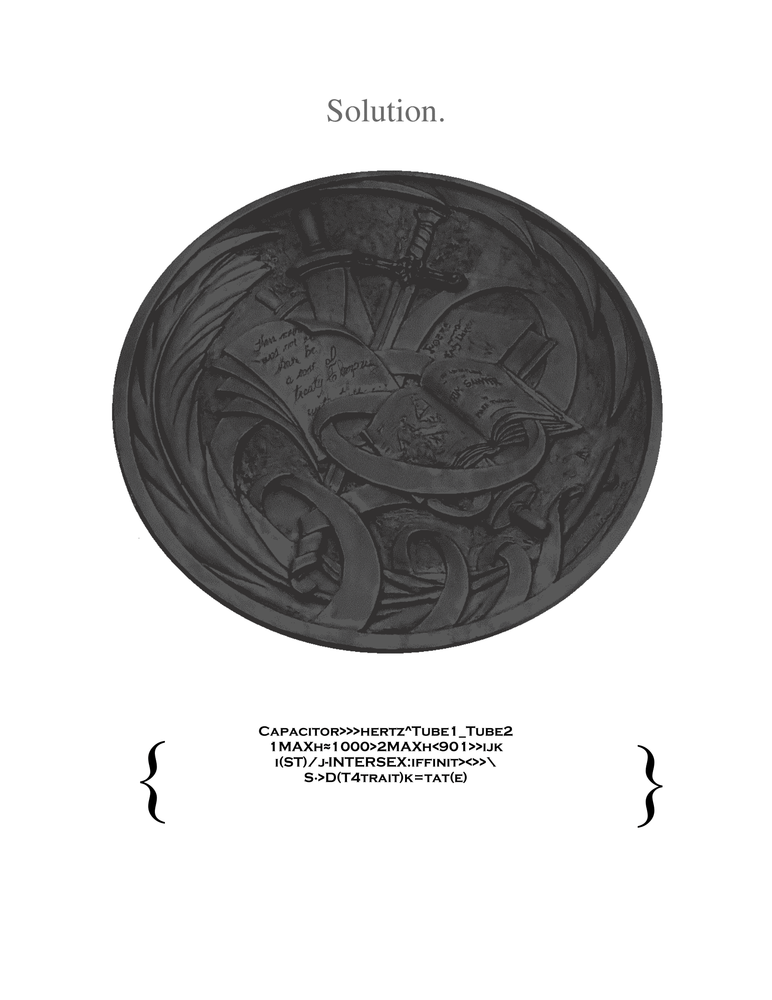

<style align="center">##The following code is an efficient greater than predicate for some iffiniT solvers## 
Capacitor>>>hertz^Tube1_Tube2 
1MAXh≈1000>2MAXh<901>>ijk 
i(ST)/j-INTERSEX:iffinit><>>\ 
S∙>D(T4trait)k=tat(e)</img>
